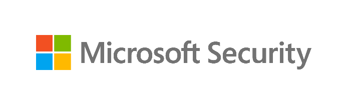

**Mitigate Compliance & Privacy Risks Workshop**

02-Module Delivery Guide-Communication Compliance

v4.2.2 - January 2023

Contents

[Disclaimer](#disclaimer)

[Version history](#_Toc123045141)

[We look forward to your feedback!](#_Toc123045142)

[1 Introduction](#_Toc123045143)

[1.1 Objectives](#objectives)

[1.2 Delivery guidance](#_Toc123045145)

[1.3 Scoping](#_Toc123045146)

[1.4 Estimated partner effort](#estimated-partner-effort)

[1.5 Tools and services used](#_Toc123045148)

[1.6 Modular setup, mandatory and optional activities](#_Toc123045149)

[2 Activity details](#activity-details)

[2.1 Step 1 - Kick-off meeting](#step-1---kick-off-meeting)

[2.2 Step 2 - Acquire and assign licenses.](#step-2---acquire-and-assign-licenses)

[2.3 Step 3 - Setup and configuration](#step-3---setup-and-configuration)

[2.3.1 Assign permissions](#assign-permissions)

[2.3.2 Confirm privacy settings](#confirm-privacy-settings)

[2.3.3 Set up groups for Communication Compliance](#_Toc123045156)

[2.3.4 Create the Inappropriate text policy](#create-the-inappropriate-text-policy)

[2.3.5 Create the Sensitive information policy](#create-the-sensitive-information-policy)

[2.3.6 [Optional] Create the Conflict of interest policy](#optional-create-the-conflict-of-interest-policy)

[2.4 Step 4 - Analyze the findings](#step-4---analyze-the-findings)

[2.4.1 Prepare for analysis—exporting the reports and log files](#prepare-for-analysisexporting-the-reports-and-log-files)

[2.4.2 Analyzing discovery findings log files and reports](#analyzing-discovery-findings-log-files-and-reports)

[2.5 Step 5 - Report and recommendations write-up](#step-5---report-and-recommendations-write-up)

[2.6 Step 6 - Decommission](#step-6---decommission)

## Disclaimer

The Mitigate Compliance & Privacy Risks Workshop provides a summary of an organization’s data protection and compliance stature and recommendations to improve data protection and compliance.

The information, results, and scoring provided through the Mitigate Compliance & Privacy Risks Workshop are recommendations and provided for general informational purposes only. They do not constitute legal advice, certifications, or guarantees regarding regulatory compliance; it is up to each organization to evaluate the effectiveness of these recommendations in their respective regulatory environment prior to implementation. Organizations should consult with their own legal professionals to determine how standards or regulations apply to their organization and how to best ensure compliance.

We hope the Mitigate Compliance & Privacy Risks Workshop helps identify technologies and additional steps that organizations can implement to simplify their compliance efforts.

MICROSOFT MAKES NO WARRANTIES, EXPRESS, IMPLIED, OR STATUTORY, AS TO THE INFORMATION IN THIS Mitigate Compliance & Privacy Risks Workshop. Microsoft disclaims any conditions, express or implied, or other terms that use of the Microsoft products or services will ensure the organization’s compliance with regulations or standards. This Mitigate Compliance & Privacy Risks Workshop toolkit is provided “as-is.” Information and recommendations expressed in the Mitigate Compliance & Privacy Risks Workshop toolkit may change without notice.

The Mitigate Compliance & Privacy Risks Workshop toolkit does not provide the user with any legal rights to any intellectual property in any Microsoft product or service. Use of the tool is for internal, reference purposes only; however, Microsoft partners may distribute the Mitigate Compliance & Privacy Risks Workshop toolkit to their customers for such customers’ internal, reference purposes only. Any distribution of the Mitigate Compliance & Privacy Risks Workshop toolkit by a Microsoft partner to its customers must include terms consistent with those set forth in this disclaimer.

© 2023 Microsoft. All rights reserved.

## Version history

| Version | Author              | Changes                                                                                                                             | Date          |
|---------|---------------------|-------------------------------------------------------------------------------------------------------------------------------------|---------------|
| 3.0     | François van Hemert | First published modular release                                                                                                     | January 2021  |
| 3.1     | François van Hemert | Updated version number to align with kit, no changes.                                                                               | February 2021 |
| 4.0     | François van Hemert | Workshop split, update to align with new narrative, rebranding, updates to guidance and update to latest product versions.          | July 2021     |
| 4.1     | François van Hemert | Added reference to Privacy Risk Management module, updated Priva branding.                                                          | January 2022  |
| 4.2     | François van Hemert | Purview branding update, step-by-step guidance update to align with changes M365                                                    | July 2022     |
| 4.2.2   | Jim Banach          | Update to align with current product features and functionality (evergreen). Added links to Communication Compliance Ninja training | January 2023  |

## We look forward to your feedback!

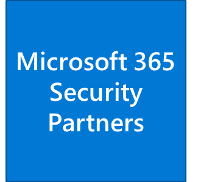Thank you for your continued trust and partnership. The resources within this toolkit will be iteratively improved upon based on product releases as well as direct feedback from delivered engagements. We encourage you to provide feedback to help us improve our products and toolkits.

Please use the feedback process through the Proof of Execution submission to help us enhance this accelerator.

# Introduction

The User Risk Check is an integral part of the Mitigate Compliance & Privacy Risks Workshop. At its core, the User Risk Check’s objective is to surface hidden privacy and regulatory risks related to behavior of employees and organizational insiders. The User Risk Check leverages Microsoft 365 tools and services in an automated process that will report on risky behavior that may impose privacy and regulatory risks to the organization.

The User Risk Check can be extended with optional modules that will be added as new products become available.

This document contains delivery guidance for the Communication Compliance activity that will extend the Automated Discovery Process to identify insider risks within the customer’s organization.

The outcome and findings of this activity will be merged into the overall findings and recommendations that will be presented at the end of the workshop.

## Objectives

The objectives for this activity are:

-   **Discover insider risks by evaluating user communication inside the organization**.**  
    **Gain visibility into existing, and at sometimes hidden, risks that might exist in the communication that is happening between users internal to the organization.
-   **Understand how to mitigate identified risks**.**  
    **Help customers to better understand, prioritize, and mitigate the identified insider risks.
-   **Provide recommendations and define next steps**.  
    Recommendations and next steps based on the findings from this activity will be rolled up into the overall Mitigate Compliance & Privacy Risks Workshop close-out presentation.

## Delivery guidance

This document is an integral part of the overall delivery guidance for the Mitigate Compliance & Privacy Risks Workshop. When delivering the User Risk Check, follow the guidance provided in the *\<00-Master Delivery Guide\>* and when instructed, engage in the supplemental activities outlined in this guide.

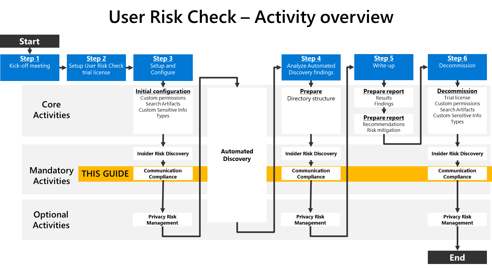

## Scoping

##### In scope

The scope for this activity includes:

-   Install and configure the Communication Compliance service.
-   Evaluate internal communication for the presence of, for example inappropriate text or sensitive information.

##### Out of scope

The scope of this activity excludes:

-   **Proof of Concept or Lab Deployment**, the *Insider Risk Discovery* activity does not include deployment of the solution in a development or proof of concept environment.

## Estimated partner effort

The table below provides a high-level estimate of the additional partner effort for the activities described in this guide. The numbers provided are to be considered indicative and can change as a result of customization of the delivery schedule and the individual activities.

## Tools and services used

The User Risk Check Automated Discovery process leverages Microsoft Purview Communication Compliance to discover and report on privacy and regulatory requirements contained in end-user communication within the organization.

##### Overview

**Communication Compliance is an insider risk solution set in Microsoft Purview that helps minimize communication risks by helping the customer’s team detect, capture, and take remediation actions for inappropriate messages in the customer organization. Pre-defined and custom policies allow the customer to scan internal and external communications for policy matches so they can be examined by designated reviewers. Reviewers can investigate scanned email, Microsoft Teams, Yammer, or third-party communications in the organization and take appropriate actions to make sure they are compliant with the organization’s message standards.**

##### **Product information**

-   **For detailed information refer to** [Learn about communication compliance in Microsoft 365](https://docs.microsoft.com/en-us/microsoft-365/compliance/communication-compliance?view=o365-worldwide)

##### **Functionality used by the User Risk Check**

**The User Risk Check will provide instructions to configure the customer’s environment for the following common compliance scenarios:**

-   **Detect inappropriate text:** Uses Microsoft’s machine learning model and multiple built-in trainable classifiers to find and prevent instances of inappropriate language being sent in communications.
-   **Monitor communications for sensitive information:** Monitors communications containing sensitive information to help prevent unauthorized leaks.
-   **Monitor for conflict of interest:** Monitors communications between two groups of users to help avoid conflicts of interest.

## Modular setup, mandatory and optional activities

The Communication Compliance module for the User Risk Check is designed in a modular setup containing both mandatory and optional activities:

-   **Mandatory activities** are required to successfully deliver Communication Compliance and must be delivered.   
    Mandatory activities include:
    -   Enabling supporting services, assigning user permissions, and implementing required configuration.
    -   Configure and enable policies to support the **Inappropriate text**  scenario.
    -   Configure and enable policies to support enable the **Sensitive information** scenario.
    -   Analyzing and documenting findings.
-   **Optional activities** can be added to the engagement depending on the customer’s needs and requirements. Optional activities available:
    -   Configure and enable policies to support the **Conflict of interest** scenario.

The illustration below provides a high-level overview of the activities that are part of the Communication Compliance module. Mandatory activities are depicted in blue, optional scenarios in yellow. For more details, refer to the upcoming paragraphs.

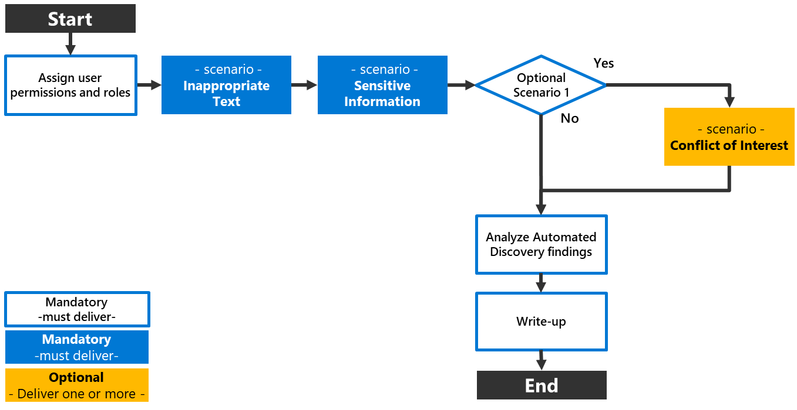

##### Mandatory activity—Enable the Inappropriate text scenario

The Automated Discovery process will leverage Communication Compliance to monitor the communication of a subset of organizational users for the presence of inappropriate messages. In the case inappropriate messages are detected, alerts will be generated on the Communication Compliance dashboard.

For more information refer to: [Case study – Contoso quickly configures an inappropriate text policy for Microsoft Teams, Exchange, and Yammer communications](https://docs.microsoft.com/en-us/microsoft-365/compliance/communication-compliance-case-study?view=o365-worldwide)

##### Mandatory activity—Enable the Sensitive information scenario

A Communication Compliance policy will be defined that will scan communications of a subset of users for the presence of sensitive information. Both generic, Out-of-box Sensitive Info Types such as for example credit card numbers, bank accounts, or social security numbers and Custom Sensitive Info Types that align with specific customer requirements, are supported.

##### Optional activity—Enable the Conflict of interest scenario

To support the Conflict of interest scenario, a policy will be created that monitors communications between two groups or two users to help avoid conflicts of interest.

# Activity details

## Step 1 - Kick-off meeting

##### Guidance

Follow the guidance for the Kick-off meeting provided in the *\<00-Master Delivery Guide\>* and add an additional section to the meeting(s) to discuss:

-   Capabilities and search artifacts for Communication Compliance.
-   The privacy aspects of using the Communication Compliance service.
-   The users to include in the Communication Compliance Automated Discovery Process.
-   The mandatory scenario’s that will be implemented.
-   The optional scenario(s).

The Pre-engagement and Kickoff deck contains optional slides with speaker notes that can be used to facilitate the discussion.

##### Supporting materials

-   *\<40-Pre-engagement and Kickoff deck\>*

    **Note**  
    *The \<40-Pre-engagement and Kickoff deck\> is used for both the Pre-engagement and the kick-off meeting. Instructions on how to update the slides are included as hidden slides in the deck.*

## Step 2 - Acquire and assign licenses.

The required product licenses for this activity are included in the overall User Risk Check trial license that was deployed in *Step 2 - Acquire and assign licenses* of the *\<00-Master Delivery Guide\>* . No additional (trial) licenses are required.

** Important  
***Users included in communication compliance policies must be assigned a license from the overall User Risk Check trial license.*

##### Background reading

For more information refer to:

-   [Subscriptions and licensing](https://docs.microsoft.com/en-us/microsoft-365/compliance/communication-compliance-configure?view=o365-worldwide#subscriptions-and-licensing)

## Step 3 - Setup and configuration

##### Guidance

This section describes the steps required to install, configure, and run *Communication Compliance* as part of the User Risk Check Automated Discovery.

Communication Compliance is configured with policies that specify supervised users and reviewers and define which types of risk indicators are configured for alerts. Before activities can trigger alerts, a policy that aligns to a usage scenario must be configured.

The guidance below provides instructions on how to enable policies to support the following scenarios for Communication Compliance:

-   **Detect Inappropriate text**
-   **Monitor for Sensitive information**
-   **[Optional] Monitor for Conflict of interest**

For the Communication Compliance module, the *Inappropriate text* and *Sensitive information* scenario will always be implemented. Additionally, the customer can choose to implement the optional scenario(s).

** Important  
***The partner should work with the customer to understand the privacy impacts of deploying these technologies in a short evaluation mode via the workshop, and if any exist, ensure appropriate safeguards are in place to protect the users.*

##### Background reading

For more information, refer to:

-   [Learn about communication compliance](https://docs.microsoft.com/en-us/microsoft-365/compliance/communication-compliance?view=o365-worldwide)
-   [Become a Communication Compliance Ninja - Microsoft Community Hub](https://techcommunity.microsoft.com/t5/security-compliance-and-identity/become-a-communication-compliance-ninja/ba-p/3283283)
-   [Manage a broad range of communication risks efficiently](https://techcommunity.microsoft.com/t5/security-compliance-and-identity/manage-a-broad-range-of-communication-risks-efficiently/ba-p/1675601)

##### Pre-requisites

Prior to starting the activities in this step, the following mandatory User Risk Check activities as described in *\<00-Master Delivery Guide\>* should be completed:

-   Step 1 - Kick-off meeting
-   Step 2 - Acquire and assign licenses
-   Step 3 - Setup and configuration

### Assign permissions

##### Guidance

There are five role groups used to configure permissions to manage Communication Compliance features.

-   Communication Compliance
-   Communication Compliance Administrators
-   Communication Compliance Analyst
-   Communication Compliance Investigator
-   Communication Compliance Viewer

For the User Risk Check engagement, all team members will be assigned to the *Communication Compliance* role group. This role group contains all the Communication Compliance permission roles and provides the easiest way to quickly get started with Communication Compliance.

**Note   
***In a production setting, it is recommended to assign users to specific role groups to manage different sets of Communication Compliance features.*

** Important  
***Assigning all User Risk Check team members to the Communication Compliance group will, in some regions of the world, be subject to privacy laws and impacted by labor laws and regulations. It is recommended to discuss this with the customer prior to implementation.*

##### Objective(s)

-   Add the relevant administrators to the *Communication Compliance* role group.

##### Background reading

For more information refer to:

-   [Step 1 (required): Enable permissions for Communication Compliance](https://docs.microsoft.com/en-us/microsoft-365/compliance/communication-compliance-configure?view=o365-worldwide#step-1-required-enable-permissions-for-communication-compliance)

##### Instructions

-   Browse to Microsoft Purview compliance portal at <https://purview.microsoft.com/compliance> and log in with Tenant Admin credentials or an account that is assigned the global admin role.
-   In the navigation pane on the left side, expand **Roles & Scopes** and click **Permissions**.
-   On the *Permissions* page, below *Microsoft Purview solutions* click on **Roles**.
-   On the *Role groups for Microsoft Purview solutions* page, search for **Communication Compliance**.   
    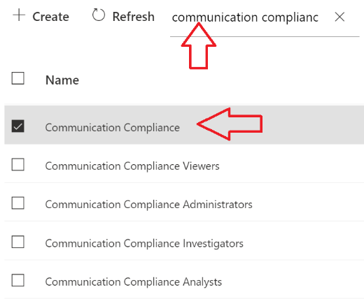
-   Click on **Communication Compliance**.
-   On the Communication *Compliance* details page, next to Members, click **Edit**.  
    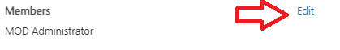
-   On the *Editing Choose Members* pane, click on **Edit** or **Choose members**.
-   On the *Choose members* pane, click on **+ Add**.
-   On the *Choose members* pane, **select all the Mitigate Compliance & Privacy Risks Workshop team members** that should be assigned the *Communication Compliance* role.
-   On the *Choose members* pane, click **Add**.
-   On the *Choose members* pane, click **Done**.
-   On the *Editing Choose* Members pane, click **Save**.
-   On the *Communication Compliance* details page, clicking **Close**.

**Note** *  
It may take up to 30 minutes for the roles assignments to take effect.*

### Confirm privacy settings

##### Guidance

The Communication Compliance solution provides a tenant level option to help customers facilitate internal governance at the user level. Protecting the privacy of users that have policy matches is important and the delivery partner should work with the customer to understand the privacy impacts of deploying these technologies and ensure appropriate safeguards are in place to protect the users.

**Note  
***For the purposes of the User Risk Check, it is recommended that keeping identity anonymized is enabled in order to manage the privacy implications of the Mitigate Compliance & Privacy Risks Workshop in the customer environment. More information about privacy settings can be found here:* [*Privacy*](https://docs.microsoft.com/en-us/microsoft-365/compliance/communication-compliance-plan?view=o365-worldwide#privacy)

##### Objective(s)

-   Verify the privacy settings for Communication Compliance

##### Pre-requisites

-   All activities described in the previous section have been completed.

##### Background Reading

-   [Privacy](https://docs.microsoft.com/en-us/microsoft-365/compliance/communication-compliance-plan?view=o365-worldwide#privacy)

##### Instructions

-   Browse to Microsoft Purview compliance portal at <https://purview.microsoft.com/compliance> and log in with Tenant Admin credentials or a user account that is a member of your User Risk Check team and has been assigned the appropriate permissions.
-   In the navigation pane on the left side, click **Communication compliance**.
-   On the *Communication compliance* page, click on **Settings (represented by the gear icon)**.
-   On the *Communication compliance \> Settings* page, below *Privacy*, verify **Show anonymized versions of usernames** is enabled,  
    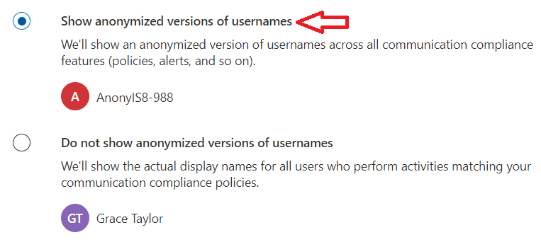

### Set up groups for Communication Compliance

##### Guidance

Users must be assigned to a compliance policy to have their communications reviewed. Additionally, special permissions must be granted to users that will be reviewing the findings. For the User Risk Check, a dedicated group will be created that will control communication review. Members of this group will be subject to communication monitoring as part of the User Risk Check.

##### Objective(s)

-   Create a user group to support the implementation of Communication Compliance.
-   Assign users to the group.

##### Pre-requisites

-   All activities described in the previous section have been completed.

##### Background Reading

-   [Step 3 (optional): Set up groups for Communication Compliance](https://docs.microsoft.com/en-us/microsoft-365/compliance/communication-compliance-configure?view=o365-worldwide#step-3-optional-set-up-groups-for-communication-compliance)
-   [Create and manage distribution list groups in Exchange Online](https://docs.microsoft.com/Exchange/recipients-in-exchange-online/manage-distribution-groups/manage-distribution-groups)
-   [Overview of Microsoft 365 Groups for administrators](https://docs.microsoft.com/office365/admin/create-groups/office-365-groups?view=o365-worldwide)

##### Instructions

-   Browse to the Microsoft 365 admin center at https://portal.microsoft.com and log in with Tenant Admin credentials or a user account that has been assigned the appropriate permissions.
-   In the left-hand menu, expand *Teams & groups* and click on **Active teams & groups**.
-   On the *Active Teams and groups* page, click on **Add a group**.
-   On the *Choose Group type* page, select **Distribution**.
-   Click **Next**.
-   On the *Setup the basics* page, name the group **UserRiskCheck-CC-MonitoringGroup** and provide a meaningful description.
-   Click **Next**.
-   On the *Assign owners page,* click **+ Assign Owners**
-   **Select** a member (or members) of the User Risk Check team that will be designated as group owners.
-   Click **Add**
-   Click **Next**
-   On the *Add members*, click on **+Add members**.
-   **Select** all users whose communications should be supervised during the User Risk Check engagement, click **Add**.
-   Click **Next**
-   On the *Edit settings* page, enter **ccmonitor** below *Group email address*.
-   Below *Communication*, **check** the box next to *Allow people outside of my organization to send email to this distribution group*.
-   Click **Next**.
-   On the *Review and finish adding group* page, click **Create group**.
-   On the *New group created* page, click **Close**.

    **Note  
    ***It can take up to* **one hour** *for the settings to go into effect and the new group can be used to configure Communication Compliance.*

### Create the Inappropriate text policy

##### Guidance

This paragraph provides instructions on how to create a Communication Compliance policy that uses built-in trainable classifiers to detect content containing inappropriate language.

##### Objective(s)

-   Create a Communication Compliance policy for the *Inappropriate text* scenario and assign users and risk indicators.

##### Background reading

-   [Case study - Contoso quickly configures an inappropriate text policy for Microsoft Teams, Exchange, and Yammer communications](https://docs.microsoft.com/en-us/microsoft-365/compliance/communication-compliance-case-study?view=o365-worldwide)

##### Instructions

-   Browse to Microsoft Purview compliance portal at <https://purview.microsoft.com/compliance> and log in with Tenant Admin credentials or a user account that is a member of your User Risk Check team and has been assigned the appropriate permissions.
-   In the navigation pane on the left side, click **Communication compliance**.
-   Below *Policies*, click on **+Create policy** and select **Detect inappropriate text** from the drop-down menu.
-   On the *Detect communications for inappropriate text* fly-out, below *Policy name*, enter **UserRiskCheck-InappropriateText** as the name of the new policy.
-   Below *Users or groups to supervise*, choose **Select users**
-   Below *Select users*, type **UserRiskCheck-CC-MonitoringGroup**
-   Below *Reviewers*, provide the names of the person(s) from the User Risk Check team that will be reviewing possible findings.
-   Below *Settings we’ve filled in for* you, **review** the settings. If needed, click **Customize policy** to make changes to the policy.
-   Click **Create policy**.
-   On the *Your policy was created* page, click **Close**.

**Note  
***It can take up to* **one hour** *for the policy to go into effect and 24 hours before reviewable alerts are generated. The status of a policy can be checked in the policy overview for Communication Compliance (Activating à Active).*

### Create the Sensitive information policy

##### Guidance

This paragraph provides instructions on how to create a Communication Compliance policy that monitors communications for sensitive information. The policy will use both Out-of-box Sensitive Info Types that are included with Microsoft 365 and Custom Sensitive Info Types that are configured to detect customer-specific keywords and information.

The instructions provided below will create a policy that monitors communications for the presence of:

-   Credit Card Numbers
-   U.S. Bank Account Numbers
-   ABA Routing Numbers
-   Customer specific info type for *Project enigma*
-   Customer specific info type for *Employee IDs*

The above Sensitive Info Types are used for illustration only and might not be applicable if your customer is in a different region or different industry. When delivering the Communication Compliance module you are encouraged to work with your customer to identify and define info types that are relevant to them.

##### Objective(s)

-   Define one or more Custom Sensitive Info Types that align with customer requirements.
-   Create a Communication Compliance policy for the *Sensitive information* scenario and assign users and risk indicators.

##### Instructions

-   Follow the guidance in *\<00-Master Delivery Guide\>* to create one or more customer-relevant Sensitive Info Types that will be used for the Sensitive information policy.
-   Browse to Microsoft Purview compliance portal at <https://purview.microsoft.com/compliance> and log in with Tenant Admin credentials or a user account that is a member of your User Risk Check team and has been assigned the appropriate permissions.
-   In the navigation pane on the left side, click **Communication compliance**.
-   Below *Policies*, click on **+Create policy** and select **Monitor for sensitive info** from the drop-down menu.
-   On the *Monitor communications for offensive or threatening language* fly-out, below *Policy name*, enter **UserRiskCheck-SensitiveInformation** as the name of the new policy.
-   Below *Users or groups to supervise*, choose **Select users.**
-   Below *Select users*, type **UserRiskCheck-CC-MonitoringGroup.**
-   Below *Reviewers*, provide the names of the person(s) from the User Risk Check team that will be reviewing possible findings.
-   Below *Sensitive info to monitor*, click on **Add sensitive info**.
-   On the *Sensitive info types* fly-out, select the following sensitive info types:
    -   Credit Card Numbers
        -   U.S. Bank Account Numbers
        -   ABA Routing Numbers
        -   Customer specific info type for *Project enigma*
        -   Customer specific info type for *Employee IDs*

            **Note  
            ***The above listed Sensitive Info Types are for illustration purposes only and should be replaced by customer relevant Sensitive Info Types.*

-   Click **Add**.
-   Below *Settings we’ve filled in for* you, **review** the settings. If needed, click **Customize policy** to make changes to the policy.
-   Click **Create policy**.
-   On the *Your policy was created* page, click **Close**.

### [Optional] Create the Conflict of interest policy

##### Guidance

This paragraph provides instructions on how to create a Communication Compliance policy that monitors communications between two groups of users across locations like Exchange, Teams, and more.

##### Objective(s)

-   Create a Communication Compliance policy for the *Conflict of interest* scenario and assign users and risk indicators.

##### Instructions

-   Follow the guidance in paragraph *2.3.3-Set up groups for Communication Compliance* and create two additional distribution groups, each containing a set of users to monitor:
    -   **UserRiskCheck-CC-MonitoringGroupA**
        -   **UserRiskCheck-CC-MonitoringGroupB**
-   Browse to Microsoft Purview compliance portal at <https://purview.microsoft.com/compliance> and log in with Tenant Admin credentials or a user account that is a member of your User Risk Check team and has been assigned the appropriate permissions.
-   In the navigation pane on the left side, click **Communication compliance**.
-   Below *Policies*, click on **+Create policy** and select **Monitor for conflict of interest** from the drop-down menu.
-   On the *Monitor communications for conflict of interest* fly-out, below *Policy name*, enter **UserRiskCheck-ConflictOfInterest** as the name of the new policy.
-   Below *Supervised group A*, type **UserRiskCheck-CC-MonitoringGroupA**
-   Below *Supervised group B*, type **UserRiskCheck-CC-MonitoringGroupB**
-   Below *Reviewers*, provide the names of the person(s) from the User Risk Check team that will be reviewing possible findings.
-   Below *Settings we’ve filled in for* you, **review** the settings. If needed, click **Customize policy** to make changes to the policy.
-   Click **Create policy**.
-   On the *Your policy was created* page, click **Close**.

## Step 4 - Analyze the findings

In Step 4 of the User Risk Check the partner will, together with the customer’s tenant / Compliance Administrator, analyze all logs, information, and reports generated by the different User Risk Check tools and services. This section describes the additional steps required to prepare and analyze the results from the *Communication Compliance* activity.

It is recommended to do a two-step analysis of the logfiles, reports, and findings:

1.  **Quick scan.** By using the various dashboards and preview views you will be able to identify common patterns and/or trends that need further investigation and can serve as an example of privacy and regulatory risks. Look for “most impactful” events related to important people within the organization, high volumes of documents related to a specific business process, Personally Identifiable Information (PII), etc.
2.  **Detailed analysis.** Using exported log and report files for the various services will allow for further investigation of previously identified privacy and regulatory risks and events flagged during the quick scan. Aim at determining the impact and risk and consider viable solutions for mitigation. During this detailed analysis you are advised to leverage the insights of the customer team because they *will know what and who to look for*. To rule out “false positives” you are advised to do further investigation of all the events that will be included in the final closeout presentation at the end of the engagement.

##### Objective

-   Export risks identified by Communication Compliance for future analysis.

##### Background reading

For more information refer to:

-   [Investigate and remediate communication compliance alerts](https://docs.microsoft.com/en-us/microsoft-365/compliance/communication-compliance-investigate-remediate?view=o365-worldwide)

### Prepare for analysis—exporting the reports and log files

##### Guidance

The Communication Compliance user interface offers a case management-focused workflow that assists in adding to policy model accuracy and moving to an investigation. To provide insights into the customer organization, numeric reporting requires extracting results from underlying data sources in the customer’s tenant.

The partner delivering this module may want to consider taking screenshots of the customer environment, if the guiding scope and customer context allow, to demonstrate to the customer how these compliance risks would enable the customer’s internal compliance and HR teams to manage conduct in the enterprise at scale.

##### Objective(s)

-   Export alerts and findings from the Communication Compliance dashboard to highlight communications activities that may represent common risks for the customer.

##### Background reading

For more information refer to:

-   [Learn about communication compliance](https://docs.microsoft.com/en-us/microsoft-365/compliance/communication-compliance?view=o365-worldwide)

##### Instructions

-   On the local workstation, if not already done, extend the previously created directory structure by adding a folder for *Communication Compliance.*

    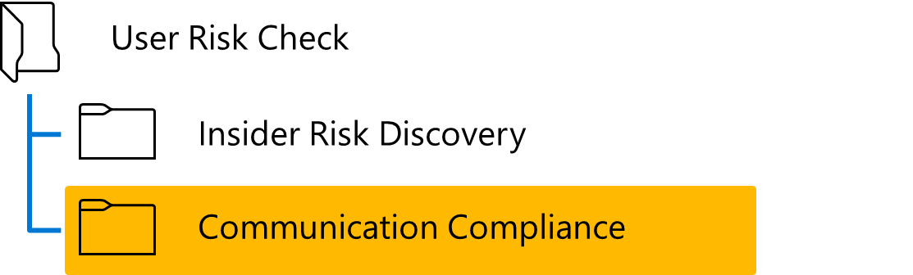

-   Browse to Microsoft Purview compliance portal at <https://purview.microsoft.com/compliance> and log in with Tenant Admin credentials or a user account that is a member of your User Risk Check team and has been assigned the appropriate permissions.
-   Click on **Communications compliance**.
-   On the *Communication compliance* pane, click on **Reports**.
-   On the *Communication Compliance* dashboard, **take screenshots** of the following widgets:

| Widget                         | Image name                               |
|--------------------------------|------------------------------------------|
| Recent policy matches          | UserRiskCheck-PolicyMatchesRecent.jpg    |
| Policies with most matches     | UserRiskCheck-PolicyMatchesMost.jpg      |
| Users with most policy matches | UserRiskCheck-PolicyMatchesMostUsers.jpg |

-   **Save** the screenshots to the *\\User Risk Check\\Communication Compliance* folder.

    **Note  
    ***Refer to* [*Use Snipping Tool to capture screenshots*](https://support.microsoft.com/en-us/help/4488540/windows-10-how-to-take-and-annotate-screenshots) *for guidance on taking screenshots.*

##### [Optional] Instructions—Export reports for further analysis

If needed, detailed reports can be exported for further analysis in, for example, Excel. Follow the steps below to export relevant reports.

-   In the *Detailed* reports section, below *Items and actions per location,* click on **View** details.
-   On the *Communication compliance\>Reports\>Items and locations per location* page, click **Export**.
-   Save the *Items and locations per location - Microsoft 365 compliance.csv* file to \\User Risk Check\\Communication Compliance folder.
-   On the top of the page, click on **Reports**.
-   In the *Detailed* reports section, below *Activity by user*, click on **View** details.
-   On the *Communication compliance\>Reports\>Activity by user* page, click **Export**.
-   Save the *Activity by user - Microsoft 365 compliance.csv* file to \\User Risk Check\\Communication Compliance folder.
-   On the top of the page, click on **Reports**.
-   In the *Detailed* reports section, below *Sensitive information types per location*, click on **View** details.
-   On the *Communication compliance\>Reports\> Sensitive information types per location* page, click **Export**.
-   Save the *Sensitive information types per location - Microsoft 365 compliance.csv* file to \\User Risk Check\\Communication Compliance folder.

### Analyzing discovery findings log files and reports

##### Guidance

The Communication Compliance findings are exported into multiple CSV files and screenshots.

The contents of these screenshots and files should be analyzed and copied to the placeholder slides in the closeout-presentation *\<41-Close out deck\>.*

##### Objective(s)

-   Analyze the reports for the *Communication Compliance* activity.

##### Instructions

| **Filename:**             | UserRiskCheck-PolicyMatchesRecent.jpg                                                                                                                                              |
|---------------------------|------------------------------------------------------------------------------------------------------------------------------------------------------------------------------------|
| **Location**              | \\User Risk Check\\Communication Compliance                                                                                                                                        |
| **Contains**              | Graph illustrating the number of policy matches since the policy was activated (depending on data available) in the customer environment.                                          |
| **Usage**                 | Provide a visual depiction of the magnitude of top policies which are matching user behaviors in the customer environment, as well as identify overall trending (up/neutral/down). |
| **Use in closeout deck?** | YES                                                                                                                                                                                |
| **Instructions**          | When creating the closeout presentation, copy the graphic to the appropriate slide in the deck.                                                                                    |
| **Sample illustration**   | 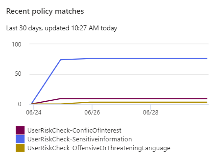                                                                                                   |

##### Instructions

| **Filename:**             | UserRiskCheck-PolicyMatchesMost.jpg                                                                                                                                                                                                                                                                                                                                                                                                                                                                                                                                                                                                                     |
|---------------------------|---------------------------------------------------------------------------------------------------------------------------------------------------------------------------------------------------------------------------------------------------------------------------------------------------------------------------------------------------------------------------------------------------------------------------------------------------------------------------------------------------------------------------------------------------------------------------------------------------------------------------------------------------------|
| **Location**              | \\User Risk Check\\Communication Compliance                                                                                                                                                                                                                                                                                                                                                                                                                                                                                                                                                                                                             |
| **Contains**              | Image of table captured from Microsoft 365 identifying policy names and match counts for the top policies in the customer environment.                                                                                                                                                                                                                                                                                                                                                                                                                                                                                                                  |
| **Usage**                 | Highlights top potential risks to the customer based on the policies which having the highest occurance in the organization’s communications, as well as a match count which serves as a proxy to the relative risk of that type of compliance problem.  **Note ***Until the customer regularly reviews alerts and begins flagging false positives and escalating cases, the model is not tuned for the customer’s use cases and cultural sensitivity. As a result, the raw data does not take false positive rate into account, but rather provides a general indicator to the risk type only.* |
| **Use in closeout deck?** | YES                                                                                                                                                                                                                                                                                                                                                                                                                                                                                                                                                                                                                                                     |
| **Instructions**          | When creating the closeout presentation, copy the graphic to the appropriate slide in the deck.                                                                                                                                                                                                                                                                                                                                                                                                                                                                                                                                                         |
| **Sample illustration**   | 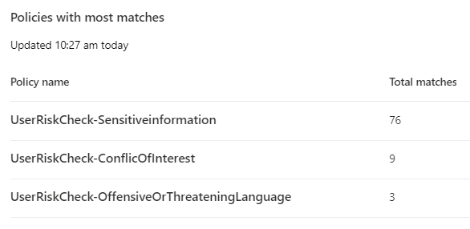                                                                                                                                                                                                                                                                                                                                                                                                                                                                                                                                                                        |

##### Instructions

| Filename:                 | UserRiskCheck-PolicyMatchesMostUsers.jpg                                                                                                                                                                                                                                                                                                                                                                                                                                                                                                           |
|---------------------------|----------------------------------------------------------------------------------------------------------------------------------------------------------------------------------------------------------------------------------------------------------------------------------------------------------------------------------------------------------------------------------------------------------------------------------------------------------------------------------------------------------------------------------------------------|
| **Location**              | \\User Risk Check\\Communication Compliance                                                                                                                                                                                                                                                                                                                                                                                                                                                                                                        |
| **Contains**              | Image of table captured from Microsoft 365 highlighting the top users and the number of matches for customer compliance activations in the customer environment.                                                                                                                                                                                                                                                                                                                                                                                   |
| **Usage**                 | Provide a specific identification of users whose behaviors are triggering the most matches across policies for communications compliance risk in the environment.  **Note ***In some jurisdictions, identifying specific users in a public context such as the meeting with the client may not be a suitable action. Work with your customer’s legal representatives for the Mitigate Compliance & Privacy Risks Workshop to determine if this is desirable for the customer presentation.* |
| **Use in closeout deck?** | YES                                                                                                                                                                                                                                                                                                                                                                                                                                                                                                                                                |
| **Instructions**          | Review the identified users with the most policy matches together with the Mitigate Compliance & Privacy Risks Workshop sponsor at the customer to determine if this graphic should be included in the closeout presentation. When creating the closeout presentation, copy the graphic to the appropriate slide in the deck.                                                                                                                                                                                                                      |
| **Sample illustration**   |  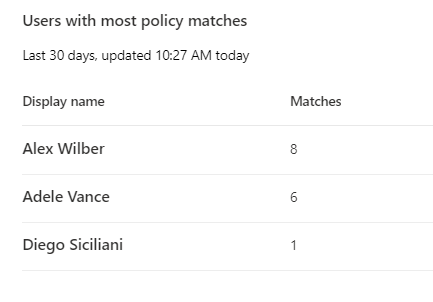                                                                                                                                                                                                                                                                                                                                                                                                                                                                  |

##### [Optional] Instructions—Analyze exported results.

The exported files provide additional detail on identified risks and can be used for further analysis. Import the exported reports into Excel following the instructions in the appendix of the *Master Delivery Guide* and use pivot tables or advanced sorting to create detailed tables.

## Step 5 - Report and recommendations write-up

##### Guidance

The Mitigate Compliance & Privacy Risks Workshop toolkit comes with a pre-populated presentation template that includes an introduction to the User Risk Check engagement, an overview of the Automated Discovery process, and placeholders for the findings and recommendations. The findings and risks identified by the *Communication Compliance* activity will be merged into this presentation and presented as an integral part of the close out presentation.

##### Objective(s)

The objectives for this activity are:

-   Update the “Results and Findings” section of the closeout presentation with the findings and risks identified by the *Communication Compliance* activity.
-   Update the “Recommendations” section of the closeout presentation with the information from the report analysis in the previous activities.

##### Deliverable(s)

For this activity, the following deliverables have been defined:

-   Section “Results and Findings” in the closeout presentation updated with the findings and risks identified by the *Communication Compliance* activity.
-   Updated “Recommendations” section of the closeout presentation with recommendations on how to mitigate the risks identified by the *Communication Compliance* activity.

##### Supporting materials

-   *\<41-Close out deck\>*

##### Instructions—Results and findings

-   Customize and update the “Results and Findings” section in the *\<41-Close out deck\>* with finding and saved screenshots from *Step 4 - Analyze the findings*. Additional guidance can be found in the speaker notes and hidden slides of the *\<41-Close out deck\>*.

    ** Important  
    ***Discuss with the customer if and how much Personally Identifiable Information (PII) is allowed to be revealed in the closeout presentation. When in doubt, obfuscate all information that could reveal users’ identity or information type.*

##### Instructions—Recommendations

-   Customize and update the “Recommendations” section in the *\<41-Close out deck\>* with recommendations for products and procedures to mitigate the privacy and regulatory risks identified. Additional guidance can be found in the speaker notes and hidden slides of the *\<41-Close out deck\>.*

## Step 6 - Decommission

##### Guidance

The final activity for the *Communication Compliance* activity is to decommission the services and tools used for this activity.

##### Objectives

The objectives for this activity are:

-   Decommission the services that were installed to support the *Communication Compliance*.

##### Deliverables

For this activity, the following deliverables have been defined:

-   All tools and services used during the Communication Compliance module are decommissioned.
-   All custom configuration artifacts are removed from the customer’s tenant.

##### Instructions—Delete the Communication Compliance policies.

-   Browse to Microsoft Purview compliance portal at <https://purview.microsoft.com/compliance> and log in with Tenant Admin credentials or a user account that is a member of your User Risk Check team and has been assigned the appropriate permissions.
-   In the navigation pane on the left side, click **Communication compliance**.
-   On the *Communication Compliance* page, click on **Policies** and **Search** for *UserRiskCheck.  
    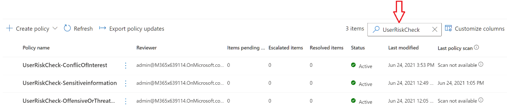*
-   Individually select all *policies* created for the User Risk Check and click **Delete**.
-   On the *Delete this policy?* pane, click **Delete**.

##### Instructions—Delete the User Risk Check Distribution groups.

-   Browse to the Microsoft 365 admin center at <https://portal.microsoft.com> and log in with Tenant Admin credentials or a user account that has been assigned the appropriate permissions.
-   In the left-hand menu, expand Groups and click on **Groups**.
-   Below *Groups* click on **Active Groups** and **Search** for *UserRiskCheck*.  
    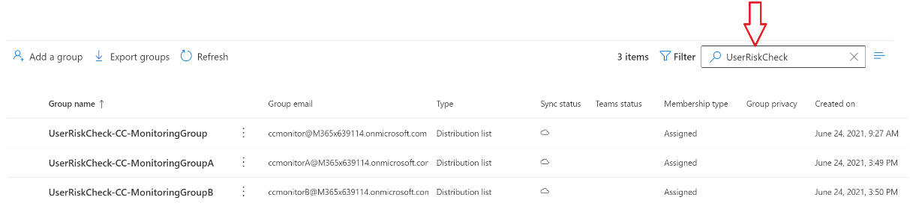
-   Individually select all *groups* created for the User Risk Check and click **Delete**.
-   Click on **Delete Group**.
-   On the *Confirmation* page, click **Delete group**.

##### Instructions—Remove users from the Communication Compliance Role Group.

-   Browse to Microsoft Purview compliance portal at <https://purview.microsoft.com/compliance> and log in with Tenant Admin credentials or a user account that is a member of your User Risk Check team and has been assigned the appropriate permissions.
-   In the navigation pane on the left side, click **Permissions**.
-   On the *Permissions* page, below *Microsoft Purview solutions* click on **Roles**.
-   On the *Permissions & Roles \> Compliance center roles* pane, search for **Communication Compliance**.   
    
-   Click on **Communication Compliance**.
-   On the *Compliance* page, next to Members, click **Edit**.  
    
-   On the *Editing Choose Members* pane, click on **Edit**.
-   On the *Choose members* pane, click on **- Remove**.
-   On the *Choose members* pane, **select all the Mitigate Compliance & Privacy Risks Workshop team members** that have been assigned to the *Communication Compliance* role.
-   On the *Choose members* pane, click **Remove**.
-   On the *Choose members* pane, click **Done**.
-   On the *Editing Choose* Members pane, click **Save**.
